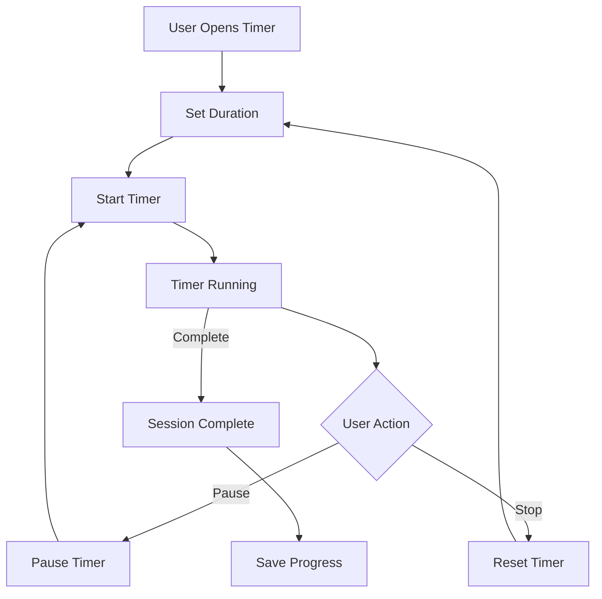
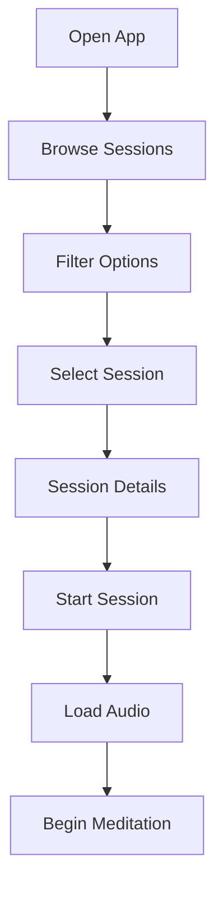
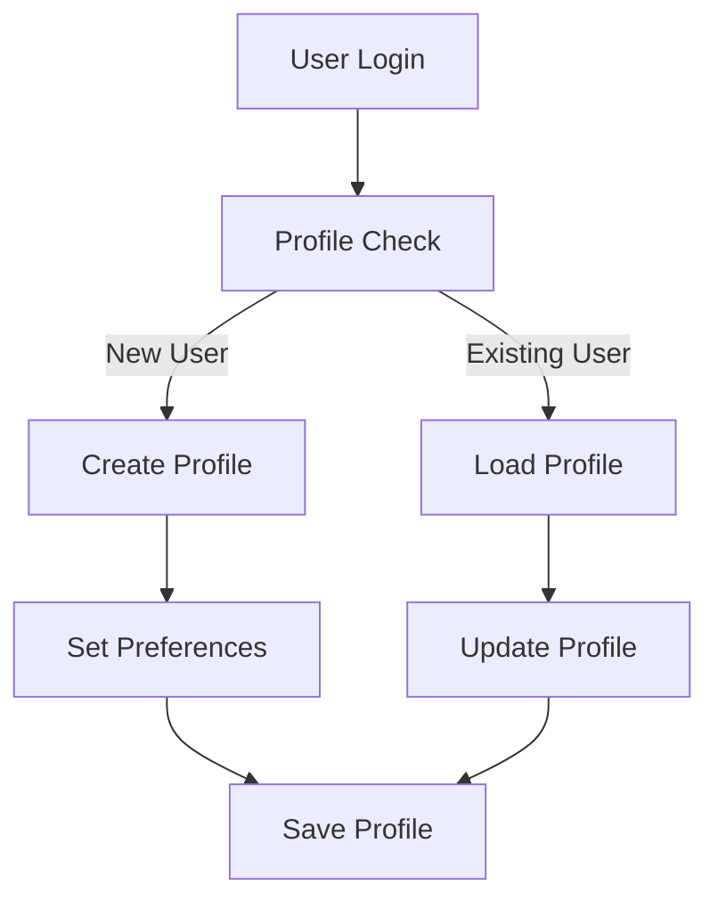
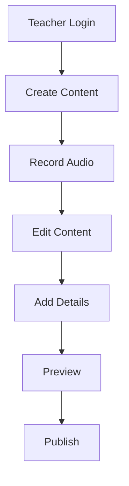
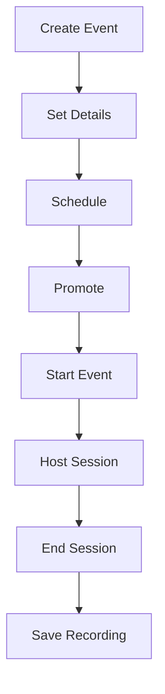
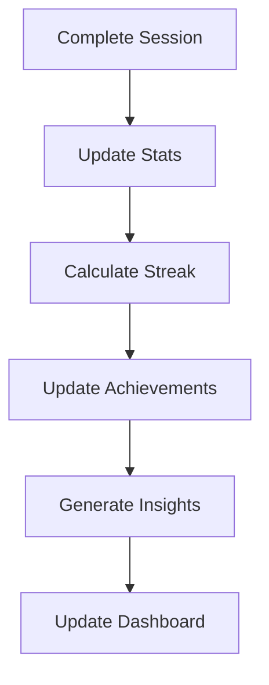
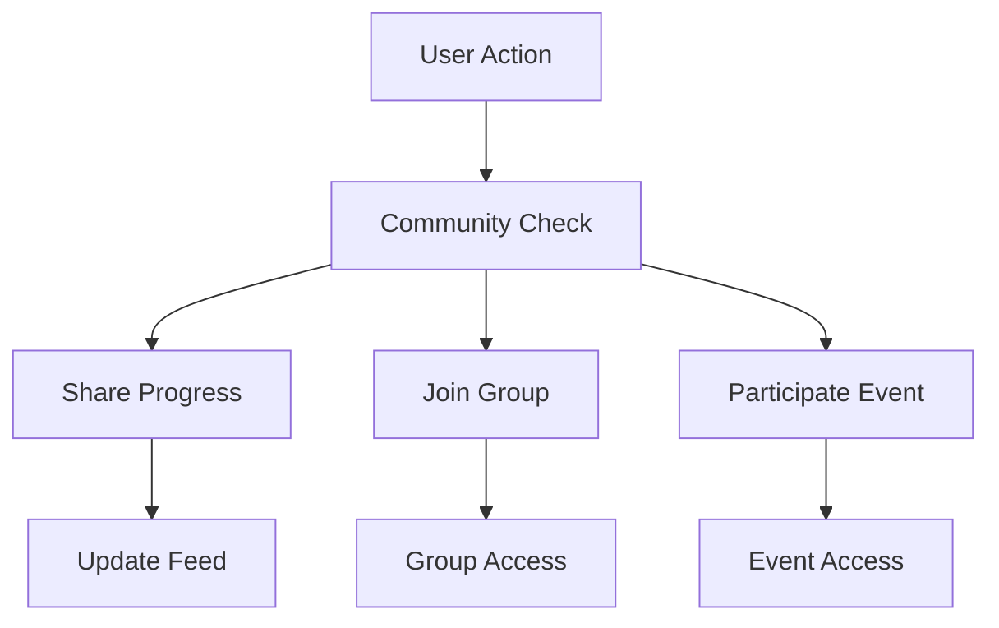
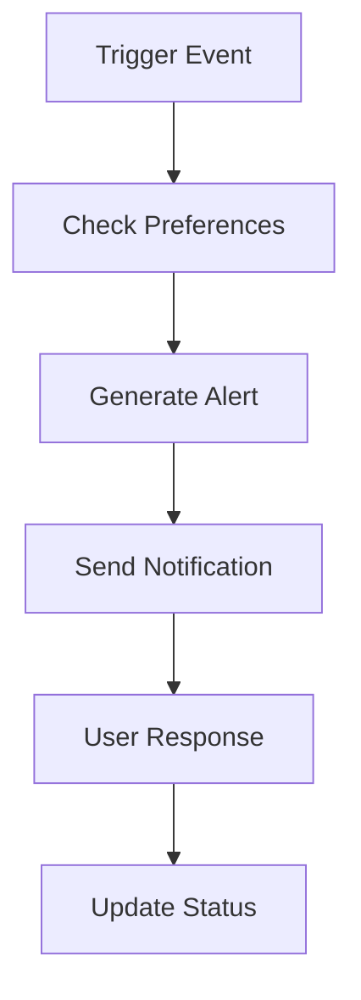

# InsightTimer - Component Workflow Documentation

## 1. Timer Component Flow

### A. Basic Timer

**How it Works:**
- User opens the timer screen
- Selects desired meditation duration
- Timer starts with visual progress
- User can pause/resume or stop
- On completion, progress is saved
- Streak and stats are updated

### B. Timer Features
1. **Duration Selection**
   - Quick-select presets for common durations
   - Custom timer for personalized sessions
   - Interval bells for longer sessions
   - Ambient sound integration

2. **During Session**
   - Circular progress indicator
   - Large, easy-to-read time display
   - Optional sound cues
   - Volume controls for background sounds

3. **Session Completion**
   - Visual celebration animation
   - Achievement notifications
   - Streak updates
   - Personalized next session suggestions

## 2. Meditation Session Flow

### A. Session Selection

**How it Works:**
- Browse available meditation sessions
- Filter by duration, type, or teacher
- View session details and preview
- Start session with audio loading
- Begin guided meditation experience

### B. Session Types
1. **Guided Meditation**
   - Professional voice guidance
   - Calming background music
   - Step-by-step instructions
   - Progress tracking

2. **Silent Timer**
   - Simple, distraction-free interface
   - Optional interval bells
   - Session completion tracking
   - Progress saving

3. **Breathing Exercise**
   - Visual breathing guide
   - Customizable patterns
   - Duration tracking
   - Pattern selection

## 3. User Profile Flow

### A. Profile Management

**How it Works:**
- New users complete profile setup
- Existing users access their profile
- Update preferences and settings
- Save changes to database

### B. Profile Features
1. **Personal Information**
   - Profile picture and name
   - Meditation preferences
   - Experience level setting
   - Personal goals

2. **Progress Tracking**
   - Complete meditation history
   - Achievement system
   - Streak tracking
   - Session statistics

## 4. Teacher Content Flow

### A. Content Creation

**How it Works:**
- Teachers access content creation
- Record meditation audio
- Edit and enhance content
- Add metadata and details
- Preview and publish

### B. Content Management
1. **Session Creation**
   - High-quality audio recording
   - Content editing tools
   - Metadata management
   - Preview functionality

2. **Content Publishing**
   - Category organization
   - Difficulty levels
   - Preview generation
   - Scheduling system

## 5. Event Management Flow

### A. Live Session Flow

**How it Works:**
- Create new event
- Set date and details
- Promote to users
- Host live session
- Record and save

### B. Event Types
1. **Live Meditation**
   - Real-time streaming
   - Participant management
   - Interactive chat
   - Session recording

2. **Workshop**
   - Registration system
   - Material sharing
   - Interactive features
   - Follow-up content

## 6. Progress Tracking Flow

### A. Data Collection

**How it Works:**
- Track session completion
- Update user statistics
- Calculate streaks
- Generate insights
- Update dashboard

### B. Tracking Features
1. **Session Data**
   - Duration tracking
   - Completion status
   - User feedback
   - Session notes

2. **Progress Analytics**
   - Streak calculation
   - Achievement system
   - Progress visualization
   - Personal insights

## 7. Community Interaction Flow

### A. Social Features

**How it Works:**
- User performs action
- System checks community features
- Updates social feed
- Manages group access
- Handles event participation

### B. Community Features
1. **Group Activities**
   - Group meditation sessions
   - Community challenges
   - Discussion forums
   - Progress sharing

2. **Social Integration**
   - Friend connections
   - Activity sharing
   - Community events
   - Teacher interaction

## 8. Notification Flow

### A. Alert System

**How it Works:**
- System detects trigger event
- Checks user preferences
- Generates appropriate alert
- Sends notification
- Tracks user response

### B. Notification Types
1. **User Alerts**
   - Daily meditation reminders
   - Streak maintenance alerts
   - Achievement notifications
   - Event reminders

2. **System Updates**
   - New content alerts
   - Feature updates
   - Maintenance notifications
   - Security alerts 