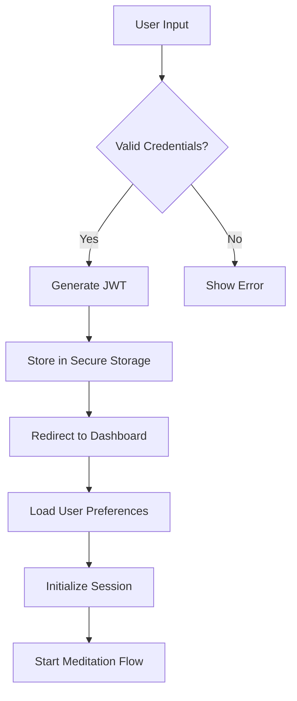
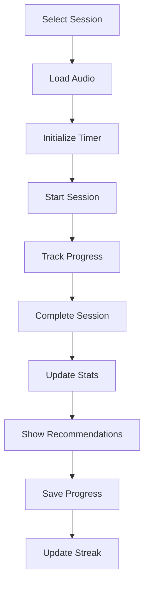

# InsightTimer Meditation App - Project Documentation

## How It Works

### 1. User Journey

#### A. New User Onboarding Process
1. **Initial Sign Up**
   - User lands on insighttimer.com
   - Clicks "Get Started" or "Sign Up"
   - Presented with two options:
     * Free Plan (limited features)
     * Premium Plan (full access)
   - Chooses authentication method:
     * Email/Password
     * Google Sign-In
     * Apple Sign-In
     * Facebook Login

2. **Profile Creation**
   - Basic Information Collection:
     * Name
     * Email
     * Profile Picture
     * Date of Birth
   - Meditation Preferences Quiz:
     * Experience Level (Beginner/Intermediate/Advanced)
     * Preferred Meditation Styles (Mindfulness/Transcendental/Breathing)
     * Goals (Stress Relief/Sleep/Focus)
     * Preferred Session Duration (5/10/15/20/30 minutes)
   - Notification Preferences:
     * Daily Reminders
     * Weekly Progress Reports
     * New Content Alerts
     * Community Updates

3. **First-Time Experience**
   - Welcome Tutorial:
     * App Navigation Guide
     * Feature Overview
     * Basic Meditation Instructions
   - Personalized Dashboard Setup:
     * Recommended Sessions
     * Daily Goals
     * Progress Tracking
   - First Meditation Session:
     * Guided Introduction
     * Basic Breathing Exercise
     * Simple Mindfulness Practice

#### B. Daily Meditation Flow
1. **Session Selection**
   - Dashboard Options:
     * Continue Previous Session
     * Recommended Sessions
     * Browse by Category
     * Search by Teacher/Topic
   - Session Details:
     * Duration
     * Difficulty Level
     * Teacher Information
     * User Ratings
     * Preview Audio

2. **Pre-Session Preparation**
   - Environment Check:
     * Quiet Space
     * Comfortable Position
     * Device Settings
   - Session Setup:
     * Audio Quality Check
     * Background Sounds Selection
     * Timer Setting
     * Session Goals

3. **During Session**
   - Guided Experience:
     * Introduction
     * Breathing Exercise
     * Main Meditation
     * Closing Practice
   - Interactive Elements:
     * Progress Indicator
     * Timer Display
     * Optional Background Music
     * Voice Guidance

4. **Post-Session**
   - Completion Screen:
     * Session Summary
     * Achievement Unlocked
     * Streak Update
   - Feedback Collection:
     * Session Rating
     * Experience Review
     * Teacher Feedback
   - Next Steps:
     * Next Session Recommendation
     * Progress Update
     * Community Sharing Option

### 2. Teacher Journey

#### A. Teacher Onboarding Process
1. **Application Submission**
   - Professional Information:
     * Teaching Experience
     * Certifications
     * Specializations
     * References
   - Content Samples:
     * Meditation Recordings
     * Teaching Videos
     * Written Content
   - Platform Agreement:
     * Terms of Service
     * Content Guidelines
     * Payment Terms

2. **Profile Setup**
   - Professional Profile:
     * Bio
     * Teaching Philosophy
     * Specialization Areas
     * Available Sessions
   - Content Management:
     * Session Categories
     * Pricing Structure
     * Availability Schedule
   - Communication Preferences:
     * Student Interaction
     * Response Time
     * Office Hours

#### B. Teaching Workflow
1. **Content Creation**
   - Session Planning:
     * Topic Selection
     * Duration Planning
     * Script Preparation
     * Music Selection
   - Recording Process:
     * Audio Recording
     * Quality Check
     * Background Music Mix
     * Final Edit
   - Content Publishing:
     * Session Description
     * Tags and Categories
     * Preview Generation
     * Release Scheduling

2. **Student Management**
   - Progress Tracking:
     * Student Attendance
     * Session Completion
     * Feedback Analysis
   - Interaction:
     * Message Responses
     * Group Sessions
     * Individual Guidance
   - Content Updates:
     * Session Improvements
     * New Content Creation
     * Archive Management

### 3. Technical Workflow

#### A. Authentication Flow

#### B. Meditation Session Flow

#### C. Data Flow Details
1. **User Data Management**
   - Profile Data:
     * Stored in MongoDB
     * Encrypted at rest
     * Regular backups
   - Session Data:
     * Real-time tracking
     * Progress updates
     * Achievement tracking
   - Preferences:
     * Local storage
     * Cloud sync
     * Cross-device support

2. **Content Delivery**
   - Audio Files:
     * CDN distribution
     * Progressive loading
     * Quality adaptation
   - Session Metadata:
     * Cached locally
     * Regular updates
     * Offline access
   - Real-time Updates:
     * Live sessions
     * Progress sync
     * Community features

3. **Analytics Processing**
   - User Metrics:
     * Session completion
     * Time spent
     * Progress tracking
   - Content Analytics:
     * Popular sessions
     * User engagement
     * Teacher performance
   - System Performance:
     * Load times
     * Error rates
     * Resource usage